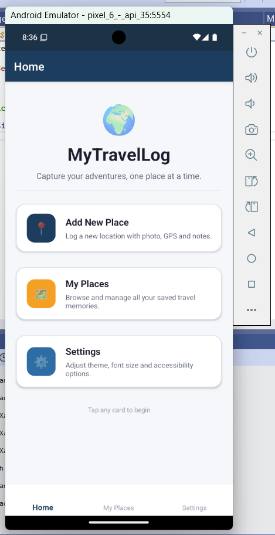
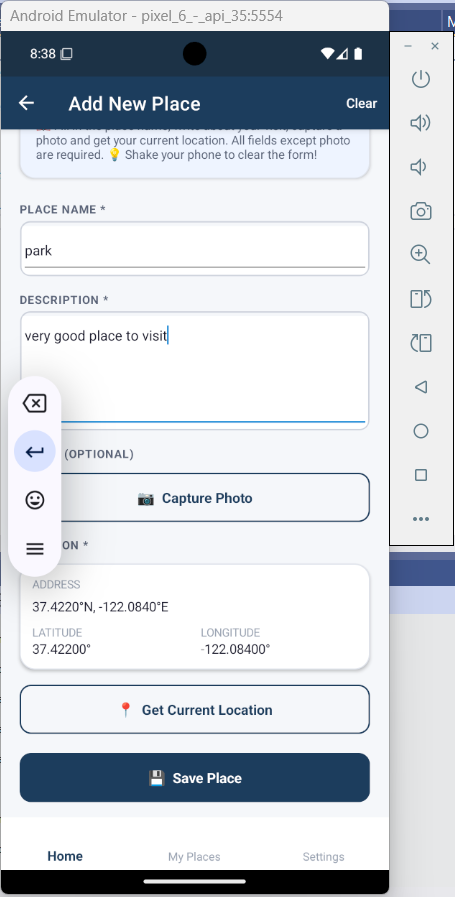
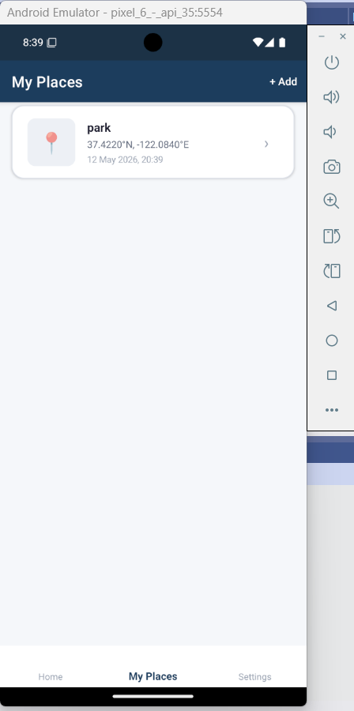
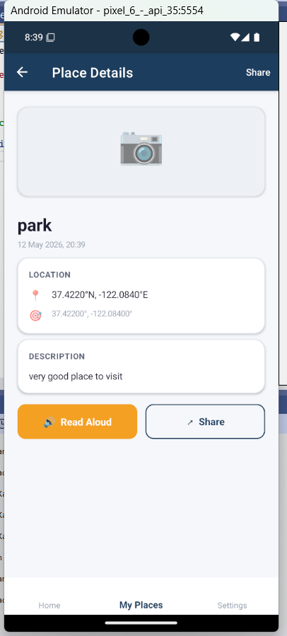
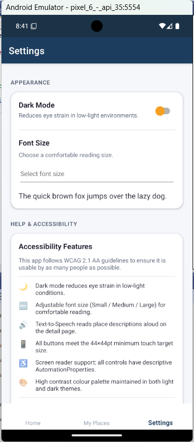
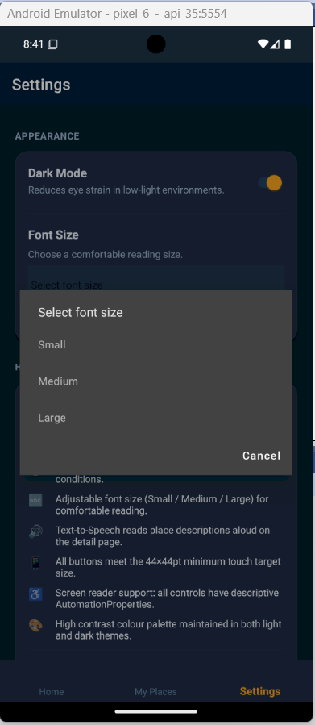

Here's your updated README — simple, human, and accurate:

```markdown
# MyTravelLog 🌍

A travel journal app built with .NET MAUI as part of my Mobile Computing 
module at Manchester Metropolitan University.

**Author:** Ahmed Sajid
**Module:** 6G6Z0014 – Mobile Computing
**Version:** 1.0.0
**Framework:** .NET MAUI with .NET 9.0

---

## What Is This App?

MyTravelLog is a mobile app where you can save memories of places you visit.
Each entry has a photo, your GPS location converted to a real address, and 
your own notes about the visit. You can browse all your saved places, have 
the description read out loud, or share an entry with someone else.

All data is saved locally on the device using SQLite, so nothing is lost 
when you close the app or restart your phone.

---

## Hardware Features Used

| Feature | How It Is Used |
|---------|---------------|
| Camera | Take a photo of the place you are visiting on the Add Place page |
| GPS / Geolocation | Gets your current coordinates when you tap Get Location |
| Reverse Geocoding | Converts your GPS coordinates into a readable address automatically |
| Haptic Feedback | Short vibration confirms when a photo is captured or a place is saved |
| Text-to-Speech | Reads the full place description aloud on the detail page |
| Accelerometer | Shake your phone on the Add Place page to clear the form |
| Vibration | Longer vibration triggers when you tap the Share button |

> Haptic Feedback and Vibration count as one hardware feature per the 
> brief. This gives 5 distinct hardware features total.

---

## Accessibility Features

I followed WCAG 2.1 AA guidelines throughout the app:

- Every button and image has a screen reader description using 
  AutomationProperties so TalkBack on Android and Narrator on 
  Windows can read them
- All touch targets are at least 44x44 pixels
- Full dark mode that switches the entire app instantly and saves 
  your preference
- Three font size options — Small 14pt, Medium 18pt, Large 22pt — 
  with a live preview
- Validation errors appear in red text right next to the field 
  that needs fixing
- Helper text on every page explains what each section does
- High contrast colours in both light and dark themes

---

## Pages

1. **Home** — Welcome screen with three cards to navigate the app
2. **Add Place** — Form to log a new place with camera, GPS and notes
3. **My Places** — Scrollable list of everything saved, swipe left to delete
4. **Place Detail** — Full view of a saved place with Read Aloud and Share
5. **Settings** — Dark mode toggle, font size picker, accessibility info

---

## Data Storage

Places are saved to a SQLite database stored on the device. This means:

- Your data survives closing the app
- Your data survives restarting the phone
- Nothing is stored online or sent anywhere
- Deleting a place also removes its photo from device storage

---

## Sharing

On the Place Detail page you can share any saved place. If the place has 
a photo it will be shared as a file through the native share sheet 
so you can send it via WhatsApp, Gmail, Messages or any other app. 
The place description, address, coordinates and date are included as text.

---

## Testing Results

### Windows
| Feature | Result |
|---------|--------|
| App launches | ✅ |
| Camera | ✅ |
| GPS and address | ✅ |
| Save and load places | ✅ |
| Dark mode | ✅ |
| Font size change | ✅ |
| Share place | ✅ |

### Android Emulator (Pixel 6, API 35)
| Feature | Result |
|---------|--------|
| App launches | ✅ |
| GPS and address | ✅ |
| Save and load places | ✅ |
| Dark mode | ✅ |
| Camera | ❌ Emulator limitation — friendly error shown |

### Physical Device (Vivo V23)
| Feature | Result |
|---------|--------|
| App launches | ✅ |
| Camera | ✅ |
| GPS and address | ✅ |
| Haptic feedback | ✅ |
| Text-to-Speech | ✅ |
| Accelerometer shake | ✅ |
| Dark mode | ✅ |
| Font size change | ✅ |
| Share with photo | ✅ |
| Data persists after restart | ✅ |

---

## Deployment

| Platform | Status |
|----------|--------|
| Windows Desktop | ✅ Fully working |
| Android Emulator Pixel 6 | ✅ Working — camera limited by emulator |
| Android Physical Vivo V23 | ✅ All features working |

---

## Problems I Ran Into

| Problem | How I Fixed It |
|---------|---------------|
| NuGet packages kept timing out | Switched to mobile hotspot and restored packages |
| Missing app icon and splash SVG | Created simple SVG files manually |
| JDK 23 not supported for Android | Downloaded JDK 21 and pointed Visual Studio to it |
| Build kept failing after changes | Clean Solution then Rebuild Solution |
| Select a valid device error | Selected Windows Machine from the toolbar dropdown |
| Camera not working on emulator | Known emulator limitation — demonstrated on Windows and physical device |
| ADB connection kept dropping | Restarted ADB server from Tools menu in Visual Studio |
| Frame obsolete warning in .NET 9 | Warning only — does not affect functionality, left as is |
| Null conditional assignment warning | Replaced with explicit null check and handler variable |
| DatabaseService namespace error | Installed sqlite-net-pcl and SQLitePCLRaw NuGet packages |
| SQLite Table attribute ambiguous | Used SQLite.Table instead of just Table to resolve conflict |

---

## Development Plan

### Phase 1 — Project Setup
- [x] Create .NET MAUI project targeting Android and Windows
- [x] Set up MVVM architecture with CommunityToolkit.Mvvm
- [x] Define colour palette and styles for light and dark themes
- [x] Register all services and views in dependency injection

### Phase 2 — Services and Data
- [x] PlaceModel with all required fields
- [x] DatabaseService using SQLite for persistent local storage
- [x] PlaceDataService bridging SQLite and the UI collection
- [x] CameraService for photo capture
- [x] LocationService for GPS and reverse geocoding
- [x] HapticService for vibration and haptic feedback
- [x] TextToSpeechService for reading descriptions aloud
- [x] AccelerometerService for shake to clear
- [x] SettingsService for saving user preferences

### Phase 3 — ViewModels
- [x] BaseViewModel with IsBusy and Title
- [x] HomeViewModel with navigation commands
- [x] AddPlaceViewModel with camera, GPS, shake and validation
- [x] PlacesListViewModel with list loading and delete
- [x] PlaceDetailViewModel with TTS and share
- [x] SettingsViewModel with dark mode and font size

### Phase 4 — Pages
- [x] HomePage with hero header and navigation cards
- [x] AddPlacePage with full form and hardware integrations
- [x] PlacesListPage with CollectionView and swipe to delete
- [x] PlaceDetailPage with TTS and share functionality
- [x] SettingsPage with theme, font and accessibility info

### Phase 5 — Polish and Testing
- [x] AutomationProperties on all controls
- [x] WCAG 2.1 AA colour contrast in both themes
- [x] 44x44 touch targets enforced
- [x] Validation and error messages on all inputs
- [x] All hardware calls wrapped in try-catch
- [x] Tested on Windows, Android emulator and physical device

---

## How to Run It

1. Open the solution in Visual Studio 2022 version 17.8 or later
2. Make sure the .NET MAUI workload is installed via Visual Studio Installer
3. Restore NuGet packages — right-click solution and choose Restore
4. Select Windows Machine or an Android device from the toolbar
5. Press F5 to build and run

For Android you will need either an emulator set up via 
Tools → Android → Android Device Manager, or a physical device 
connected via USB with USB Debugging enabled.

---

## Project Structure

```
MyTravelLog/
├── Models/
│   └── PlaceModel.cs
├── Services/
│   ├── DatabaseService.cs
│   ├── PlaceDataService.cs
│   ├── CameraService.cs
│   ├── LocationService.cs
│   ├── HapticService.cs
│   ├── TextToSpeechService.cs
│   ├── AccelerometerService.cs
│   └── SettingsService.cs
├── ViewModels/
│   ├── BaseViewModel.cs
│   ├── HomeViewModel.cs
│   ├── AddPlaceViewModel.cs
│   ├── PlacesListViewModel.cs
│   ├── PlaceDetailViewModel.cs
│   └── SettingsViewModel.cs
├── Views/
│   ├── HomePage.xaml
│   ├── AddPlacePage.xaml
│   ├── PlacesListPage.xaml
│   ├── PlaceDetailPage.xaml
│   └── SettingsPage.xaml
├── Helpers/
│   ├── Converters.cs
│   └── ValidationHelper.cs
├── Resources/Styles/
│   ├── Colors.xaml
│   └── Styles.xaml
└── Platforms/
    ├── Android/
    │   ├── AndroidManifest.xml
    │   └── Resources/xml/file_paths.xml
    └── Windows/
        └── App.xaml
```

---

## Screenshots








---

## Notes for Markers

- The screencast covers every criterion in the order listed in the 
  marking scheme
- All hardware features are shown live on the physical Vivo V23 device
- GitHub commit history shows development across multiple sessions
- The accelerometer shake feature is demonstrated by physically shaking 
  the device during the screencast
- SQLite persistence is demonstrated by closing and reopening the app 
  to show data is still there
```